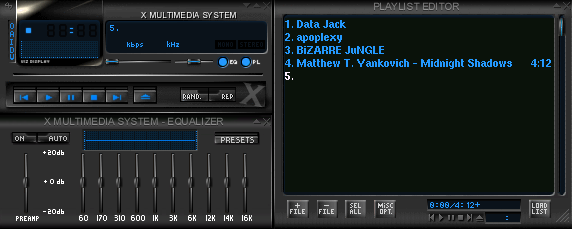
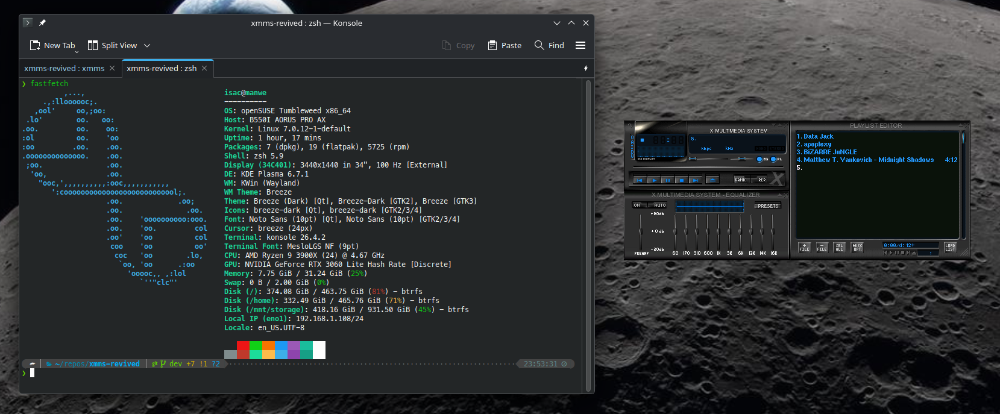

# XMMS revived

XMMS rewritten for modern Linux systems

Migrated to GTK2 and glib2

[Build instructions](./BUILDING.md)

[Debuggning instructions](./DEBUGGING.md)

If you're visiting on github you're on the mirror,

visit the original repo on: https://git.yeold.org/yeold/xmms-revived

### What works and what doesn't

At the moment I've verified the following things work:
- Music playback
- Music quequing
- Add one song at a time

What kinda works/bugs:
- Some visual effects (some crashes at closing)
- Drowdown menu moves to the top left of the screen

What doesn't work:
- Play Directory
- Playlist menus
- Volume slider doesn't do anything
- Balance slider doesn't work
- Equalizer
- Repeat
- Random song
- Jump to next song
- Play location

There are a lot of untested things that I still haven't verified though.